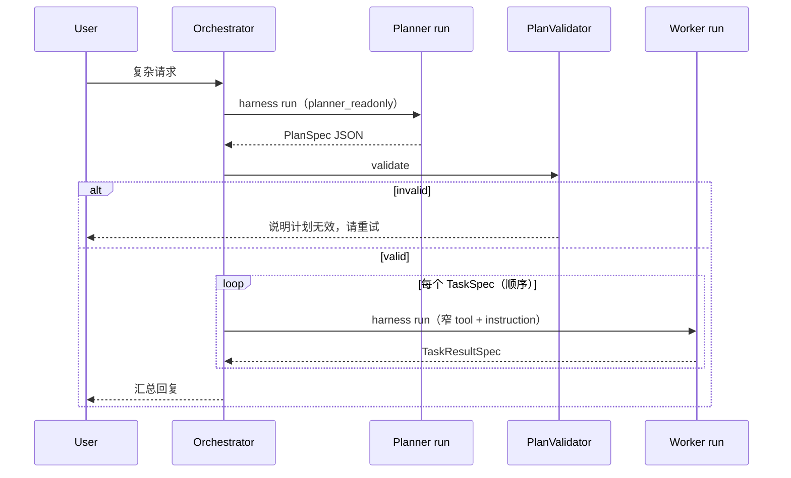

# Phase 3：结构化计划（单线程执行）设计草案

> 状态：PR-3a–3f + PR-3g（Plan 并行 subagent）已落地；PR-3d Reviewer 暂停。前置：Phase 2 + harness 18/18。

## 1. 目标

在**不引入并行 subagent** 的前提下，让 Cora 对复杂请求先产出**可校验的结构化计划**，再**按步执行**，每一步仍走现有 `DefaultAgentHarness` + `ToolPolicyEngine`。

用户可感知变化：

- 复杂任务不再依赖模型「一口气」调多个 tool
- 每步有明确任务描述、tool 边界、trace 可审计

## 2. 非目标（本阶段不做）

- Planner / Worker 并行
- `spawn`、子 run 树（Phase 4）
- Checkpoint / 长时 resume（Phase 5）
- 替换现有微信文件检索主路径

## 3. 核心对象

```python
# 示意 — 实现时放入 core/schemas/plan.py

@dataclass
class TaskSpec:
    task_id: str
    title: str
    tool_names: list[str]          # Worker 本步允许暴露的 tool 子集
    instruction: str               # 给 Worker 的用户/系统任务描述
    requires_review: bool = False

@dataclass
class PlanSpec:
    plan_id: str
    session_id: str
    goal: str
    tasks: list[TaskSpec]
    policy_profile: str | None = None

@dataclass
class TaskResultSpec:
    task_id: str
    run_id: str
    status: str                    # completed | failed | skipped
    summary: str
    tool_trace_count: int = 0

@dataclass
class PlanRunSpec:
    plan_id: str
    status: str                    # planning | executing | completed | failed
    task_results: list[TaskResultSpec]
```

## 4. 角色与工具边界

| 角色 | agent_role | 工具策略 | 说明 |
|------|------------|----------|------|
| **Planner** | `planner` | 只读 profile（`background_readonly` 或专用 `planner_readonly`） | 仅 `read_file`、`search_*`、`web_search` 等；**禁止** `write_file`、`shell_exec`、`scheduled_tasks` |
| **Worker** | `worker` | 每步 `RunBudget.allowed_tool_names = task.tool_names` | 继承 `ToolPolicyEngine`；HITL / sandbox 规则不变 |
| **Plan 并行 subagent** | （执行层） | 同 plan 父 budget 子集 | `parallel_subagents` → `spawn_workers`；适合多路径并发 search |
| **Reviewer**（暂停） | `reviewer` | 只读 | 仅在高风险步或低 confidence 后触发 |

Planner 输出必须是 **JSON PlanSpec**（或 YAML 子集），由 `PlanValidator` 校验：

- `task_id` 唯一
- `tool_names` 非空且均为 registry 已注册名
- 不允许 Planner 步包含 `shell_exec`（微信场景）

## 5. 执行流程



**与现有组件关系：**

- 每个 Planner / Worker 步 = 一次 `HarnessRunInput`（独立 `run_id`，可选 `parent_run_id=plan_run_id`）
- Worker 步 `metadata` 带 `plan_id`、`task_id`
- 不新增 parallel harness；`max_child_runs` 留到 Phase 4

## 6. 触发条件（何时走 Planner）

v1 建议 **显式 + 启发式** 并存：

1. **显式**：用户消息以 `/plan` 开头，或 session metadata `force_planning=true`
2. **启发式**（可选）：单轮预估需 2+ 次 mutating tool，或模型在 planner 模式下输出 plan

默认微信文件助手路径**不自动**走 Planner，避免打断「找文件 / 发文件」体验。

## 7. 失败与 HITL

- Worker 步触发 `policy_ask`：行为与现网一致（微信 `确认` / `拒绝`）；`PlanRun` 状态置 `waiting_hitl`，批准后继续**当前 task**，不重做 Planner
- Worker 步 `policy_denied`：记 `TaskResultSpec.failed`，可选 abort 整个 plan 或 skip 该步（v1 建议 **abort plan**）
- Planner 无效 JSON：不创建 Worker run，trace `plan.validation_failed`

## 8. 持久化（建议）

| 表 / 字段 | 内容 |
|-----------|------|
| `clawbot_plans` | plan_id, session_id, plan_json, status, created_at |
| `clawbot_agent_runs.parent_run_id` | 已有；Worker 指向 plan 根 run |

也可 v1 仅写入 `agent_runs.metadata_json.plan_id` 降低 schema 面。

## 9. 实现切片（推荐 PR 顺序）

### PR-3a：Schema + Validator（无模型）— **已完成**

- `src/core/schemas/plan.py` — `PlanSpec`, `TaskSpec`, `TaskResultSpec`, `PlanRunSpec`, `plan_spec_from_dict`
- `src/core/agent/plan_validator.py` — `PlanValidator`, `PlanValidationResult`, WeChat forbidden tools
- `planner_readonly` harness profile（与 planner 只读 tool 集对齐）
- 测试：`tests/test_plan_validator.py`（8 cases）

### PR-3b：Planner harness 步 — **已完成**

- `agent_role=planner` + `planner_readonly` profile（`plan_planner.py`、`harness.py`）
- `ClawBotService.plan_turn()`；Dev model `/plan` + `[Planner mode]` stub（`CORA_EVAL_PLANNER_STUB`）
- Trace：`plan.created`、`plan.validation.completed` / `plan.validation.failed`
- Eval：`planner_valid_plan_records_trace`、`plan_validation_rejects_unknown_tool`
- 测试：`tests/test_plan_planner.py`

### PR-3c：顺序 Worker dispatch — **已完成**

- `src/core/agent/plan_executor.py` — `PlanExecutor`、Worker budget、`build_worker_user_text`
- `src/core/agent/plan_store.py` — `PlanStore` 协议；生产 `SqlPlanStore`，测试/无 DB 时 `InMemoryPlanStore`
- `ClawBotService.execute_plan_turn()`；`/execute` 触发顺序 Worker harness run
- Planner 成功后写入 plan store；Worker `parent_run_id` 指向 planner run
- Eval：`plan_single_task_worker_completes`（plan + execute 两步）
- 测试：`tests/test_plan_executor.py`

### PR-3e：Plan 执行中 HITL 暂停与续跑 — **已完成**

- `StoredPlanExecution` + `PlanStore.save_execution` / `get_execution`
- `PlanExecutor.resume_task_after_hitl` + `execute(start_task_index=…)`
- `ClawBotService.approve_plan_execution_hitl_and_resume`；`approve_hitl_and_resume` 自动路由
- 微信「确认」在 plan 暂停时继续当前 task，不重跑 Planner
- Eval：`plan_worker_hitl_pause_and_resume`；stub `CORA_EVAL_PLANNER_STUB=hitl`
- 测试：`tests/test_plan_execution_hitl.py`

### PR-3f：Plan 持久化（SQL）— **已完成**

- `clawbot_session_plans`（`SessionPlanRecord`）：`plan_json` + 可选 `execution_state_json`（HITL 暂停续跑）
- `SqlPlanStore` in `src/core/storage/repositories.py`；`build_clawbot_container()` 注入 `ClawBotService`
- 新 validated plan 写入时清除陈旧 execution 状态（与内存 store 一致）
- 测试：`tests/test_sql_plan_store.py`

### PR-3g：Plan 任务委派并行 subagent（`parallel_subagents`）— **已完成**

- `TaskSpec.parallel_subagents`：Planner 为可并发的只读搜索列出多路子任务
- `PlanExecutor` 在该步调用 `spawn_workers_for_tool`（非顺序 Worker turn）
- `PlanSubtaskSpec`：`instruction` + `tool_names`；校验见 `plan_validator.py`
- Planner prompt 借鉴 OpenCode：1–3 路并行探索、每路独立焦点、复杂任务先 search 再 worker
- Eval：`plan_parallel_subagent_search_completes`、`plan_parallel_three_way_search_completes`

### PR-3h：真实 LLM Planner 产出 `parallel_subagents` — **已完成**

- OpenAI Planner turn 使用 `response_format=json_object`（`PlannerAwareModelClient` + `orchestrator`）
- 系统与用户提示已包含 `parallel_subagents` 形状与选用规则（`PLANNER_GUIDANCE`、`build_planner_user_text`）
- 集成测试：`tests/test_planner_llm_parallel.py`（`SimulatedLlmPlannerModelClient` 走完整 `plan_turn` 路径）
- Live eval（可选）：`plan_llm_parallel_search_planner`；默认 harness 跳过 `live` tag，运行 `scripts/run_live_planner_evals.cmd`（需 `CORA_RUN_LIVE_EVALS=1` 与 `CORA_OPENAI_API_KEY`）

### PR-3d（暂停）：Reviewer + 失败策略细化

## 10. Eval 计划

| Case ID | 验证点 |
|---------|--------|
| `plan_validation_rejects_unknown_tool` | 非法 plan 不执行 Worker |
| `plan_single_task_worker_completes` | 一步 plan + tool 成功 |
| `plan_worker_hitl_pause_and_resume` | 计划步中 ask，确认后继续 — **已实现** |
| `plan_parallel_subagent_search_completes` | `parallel_subagents` + `spawn_workers` 并发 search — **已实现** |
| `plan_parallel_three_way_search_completes` | 三路 `parallel_subagents` 并行 search — **已实现** |
| `plan_llm_parallel_search_planner` | Live OpenAI Planner 产出 `parallel_subagents` — **已实现（live tag，可选运行）** |

## 11. 验收标准

- `.\scripts\run_harness_evals.cmd` 在 Phase 3 slice 合并后仍全绿（只增 case，不破坏既有 harness case）
- Planner 步 **零次** mutating tool 调用（trace 审计）
- Worker 步 tool 仅来自 `TaskSpec.tool_names` 交集

## 12. 参考

- [cora-multi-agent-harness-implementation.md](./cora-multi-agent-harness-implementation.md) — Phase 3 总览
- [wechat-hitl.md](./wechat-hitl.md) — WeChat 确认交互
