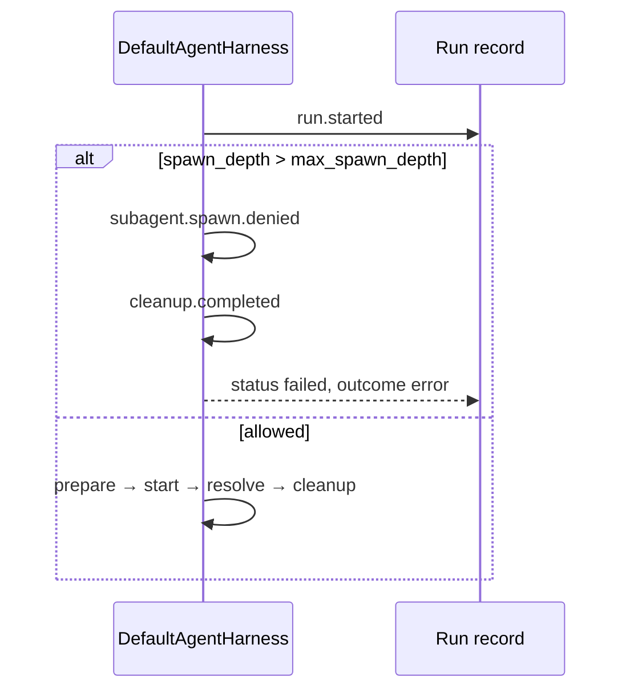

# Phase 4：受控 Subagent 设计草案

> 状态：PR-4a 已落地（spawn 深度预算 + harness 拒绝 + eval）；4b–4e 未开始。  
> 前置：Phase 3（Planner / Worker / HITL / plan SQL）+ harness 18/18。

## 1. 目标

在**有硬边界**的前提下，允许主 run 拉起**子 harness run**（subagent），用于：

- 把重探索/子任务隔离到子 session + 子 trace
- 子 run **继承更窄**的 tool policy，不能比父 run 更宽
- 子结果结构化合并回父 run（4d）

本阶段**不做**：并行 subagent 风暴、外部 MCP agent、checkpoint 长时恢复（Phase 5）。

## 2. 核心概念

| 字段 | 含义 |
|------|------|
| `spawn_depth` | 当前 run 在 spawn 树中的深度：`0` = 根（用户会话主 run），`1` = 子 run，`2` = 孙 run |
| `max_spawn_depth` | 本 run **允许的最大深度**；若 `spawn_depth > max_spawn_depth`，harness **拒绝启动** |
| `max_child_runs` | 单父 run 可 spawn 的子 run 上限（4b，本 PR 仅 schema 预留） |
| `parent_run_id` | 已有；子 run 指向父 `run_id`（plan Worker 已使用） |

**深度规则（v1）**

- 默认 `max_spawn_depth = 1`（`CORA_HARNESS_MAX_SPAWN_DEPTH`）：允许 depth `0` 与 `1`，拒绝 `2+`。
- 将来 spawn 工具：`child_depth = parent.spawn_depth + 1`，子 run 继承 `min(parent.max, config_default)`。

## 3. 角色与 PR 切片

| PR | 内容 | 状态 |
|----|------|------|
| **4a** | `spawn_depth` / `max_spawn_depth`、harness 启动前拒绝、`subagent.spawn.denied` trace、eval | ✅ |
| **4b** | `spawn_worker`（或内部 API）、子 session、子 run 记录 | 未开始 |
| **4c** | 继承 tool policy（子 ⊂ 父 allow 集） | 未开始 |
| **4d** | 子 run `ResultSpec` 合并回父 / plan 下一步 | 未开始 |
| **4e** | eval：spawn 超限、policy 继承 deny、merge 失败 | 未开始 |

## 4. Harness 行为（4a）

拒绝时用户可见文案（英文，与 tool budget 一致）：

> Subagent spawn depth exceeded (depth=N, max=M).

## 5. 与 Phase 3 的关系

- Plan Worker 已设 `parent_run_id`；**不**自动提高 `spawn_depth`（仍为 0），直到 4b 显式 spawn。
- Reviewer（PR-3d）继续可选，不阻塞 Phase 4。

## 6. 验收（4a）

- `spawn_depth_exceeds_max_denied` eval：metadata `spawn_depth=2` + budget `max_spawn_depth=1` → failed + trace 含 `subagent.spawn.denied`
- `.\scripts\run_harness_evals.cmd` 全绿（19 cases）

## 7. 参考

- [cora-multi-agent-harness-implementation.md](./cora-multi-agent-harness-implementation.md) — Phase 4 总览
- [cora-phase3-planning-design.md](./cora-phase3-planning-design.md) — 顺序 plan 执行
